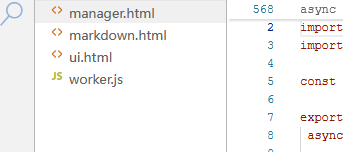
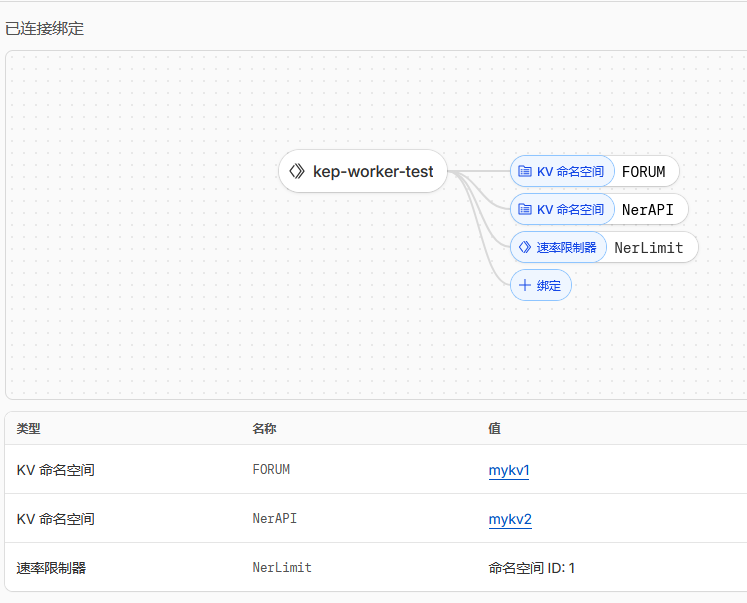
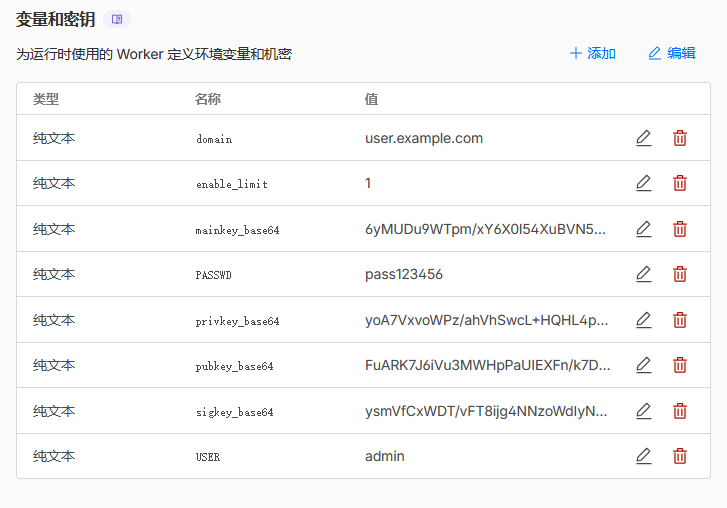

# kep-worker
cf worker 搭建个人 bbs 论坛

## 部署方法

长话短说

 

### 1.把这三个文件传到cf worker里面

---

### 2.绑定2个KV与1个速率限制器到worker

速率限制器设置为300次/60s

---

### 3.添加下面变量到worker

变量可以选纯文本与密钥，这里为了示例，使用纯文本

---

### 4.添加静态资源

把官方的[三个静态资源](https://github.com/stalltrix/kepweb/tree/master/static)绑定到/static/*上

`ui.html`，`markdown.html`，`manager.html`也是官方仓库拷过来的。可以自己跟随上游更新

---

### 5.其他

#### 变量解释

- domain: kep验证域名，联机时候用，单机随便填
- enable_limit: 开启速率限制
- USER: 登录用户名
- PASSWD: 登录密码
- mainkey_base64: `openssl base64 -in mainkey.pub -out mainkey.txt`获取
- pubkey_base64: `openssl base64 -in pkey.pub -out pkey.txt`获取
- privkey_base64: `openssl base64 -in pkey.priv -out privkey.txt`获取
- sigkey_base64: `openssl base64 -in pkey.sig -out sginkey.txt`获取

4个base64 key，使用kep-cli生成。`kepcli -act gen`，会生成新的密钥到当前目录。

mainkey与pkey的TXT记录，需要绑定在domain上才能联机。单机使用只用填进去就行。

 

### LICENSE

静态资源是直接拷贝官方的，参照原许可。js程序使用MIT许可证。
